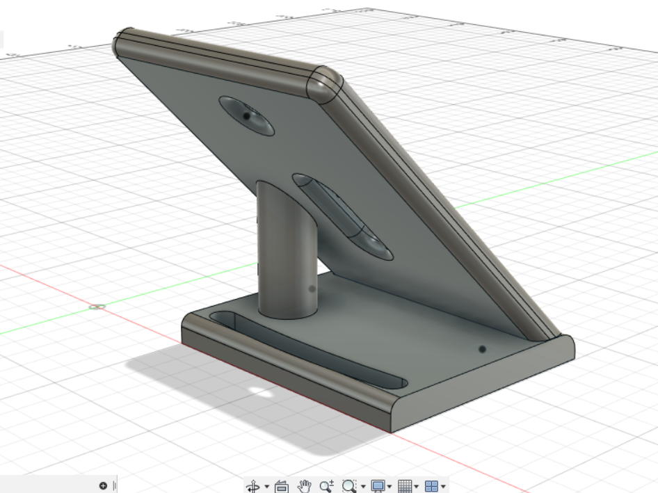
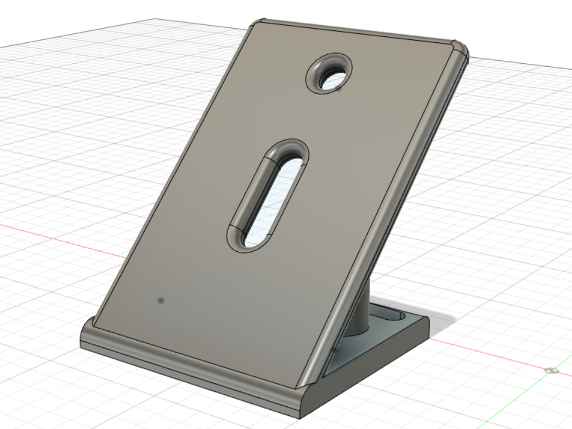
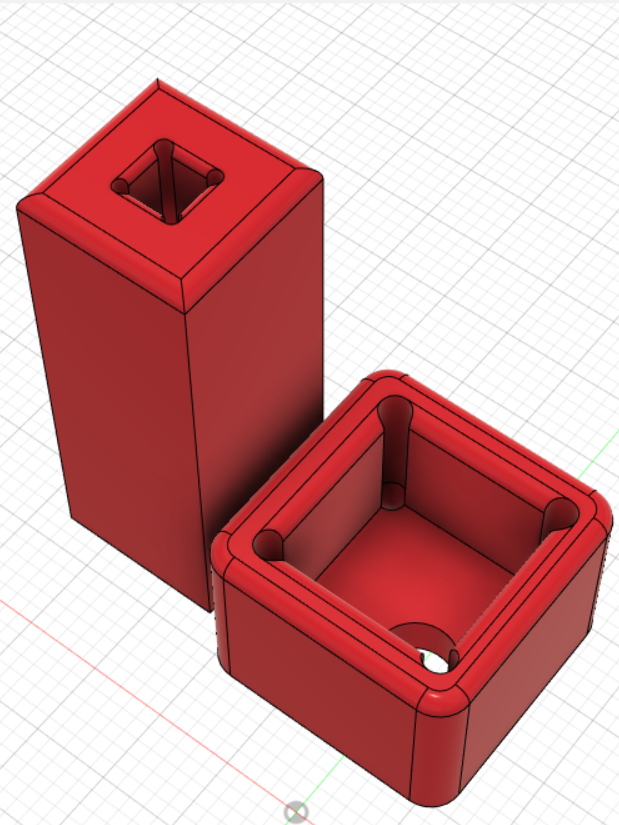
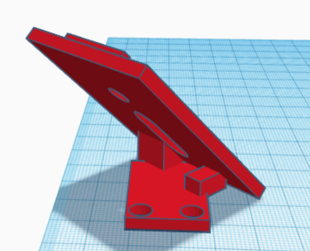
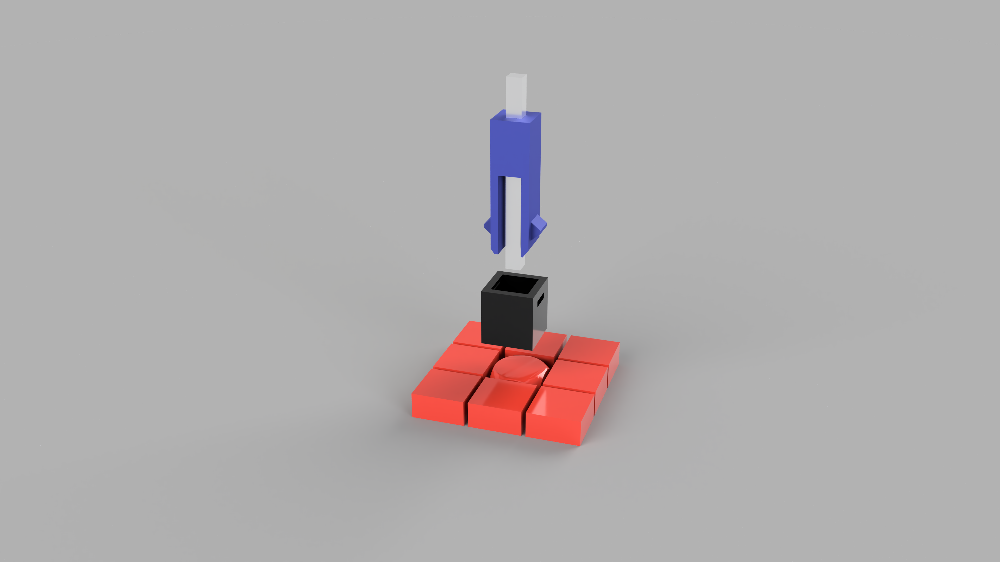
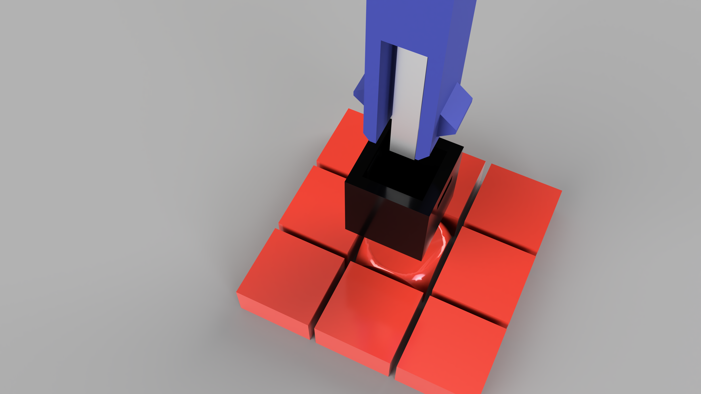
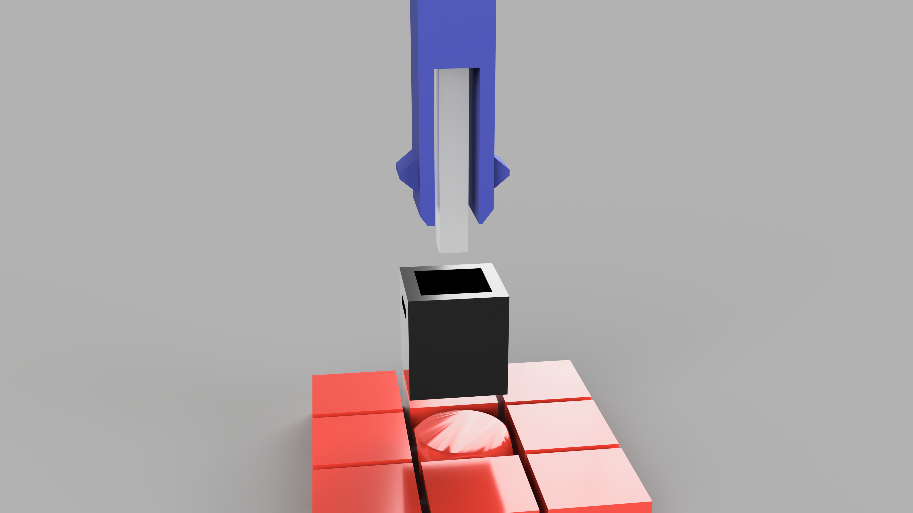
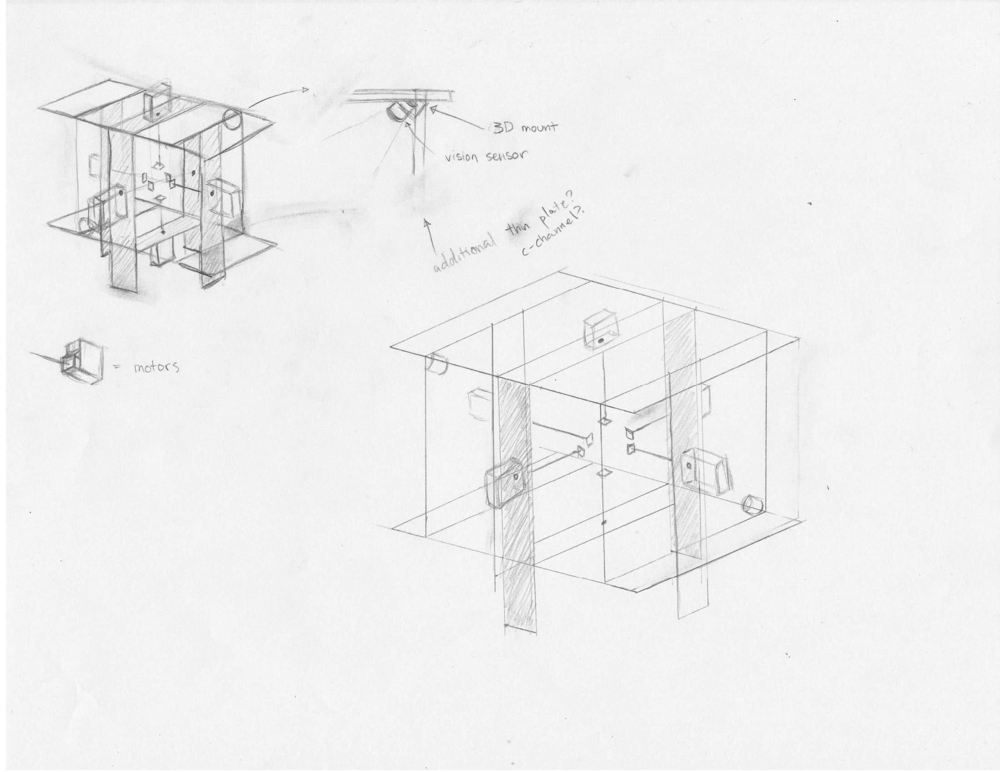
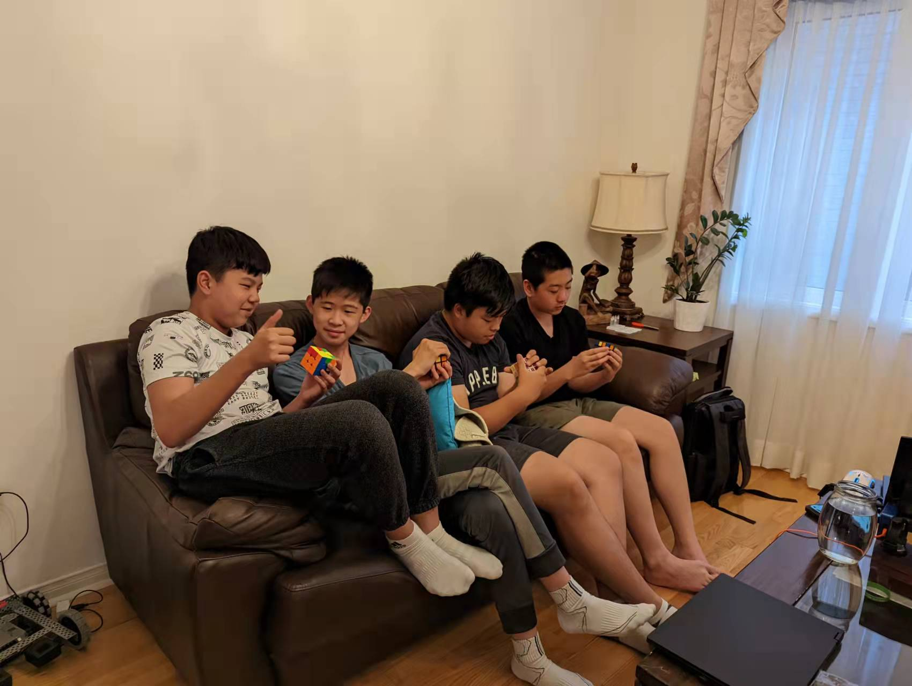

# Activities

## 2023-04-01

* Tested visual sensor
  * Calibrated vision sensor to the new cube and colours
  * Ordered final designs with final adjustments and revisions
* Started debugging the functions
* Work done on the final step software-wise(F2L)

## 2023-03-11

* Tested Prototype
  * Working Model (Rotations)
  * Notes on Improving
    * Shorten Cube Clasp to 9cm
    * Change Clasp Color
    * Minor Changes to Shaft Mount
  * Adapted new Lock-on Method
* Adjustments and Revisions to Function List
* Notes on Next Time: Vision Sensor Adaptation to new cube

## 2023-02-18

* Vision Sensor calibration
  * Made significant progress
  * Ryan has some technical difficulties and sporatic tendancies
* Completed PLL recognition
* Completed PLL process
* Made progress in 3D models

## 2023-02-11
* Completed certification for Makerspace 3D Printing
  * Completed Introductory course
  * Completed Introduction to 3D Printing
* Made considerable progress in PLL
  * Headlight determination
* Had a team building exercise
  * Discussed team adjectives

## 2023-01-28
	* Made progress in PLL code
	* Made progress in F2L
	* Submit files for 3d printing
		* Rubix cube clasp
		* modelling and reviewing

## 2022-12-17

* 3D Design and Modelling Progress:
* Tested new rubiks cube clasp
	* part performs better than expected, design revisions effective
* Tested new vision sensor mount
	* part is functional, may revise design for more flexibility
* Revised rubiks cube clasp to final dimensions
	* lengthened to fit robot dimensions and rubiks cube
	* added pattern for better adhesion and traction
	* sent in for printing

## 2022-11-26

* "Reflection" Session: summarized current progress into points and into percent figure, and made to-do list
* Summarized Current Progress:
	* BEN:
	* F2L and PLL
	* OLL:
	* Done, need to debug
	* PLL:
	* almost finished, may still have bugs
	* Overall: Almost finished coding, but need some help. Code waiting for major debug.
	* RYAN:
	* F2L
	* need algorithm, but finished decision making system
	* Overall: Made significant progress, still working on it
	* EVAN:
	* White Face:
	* White cross done
	* need to find way to put corners in white face
	* First Layer:
	* similar to PLL, so will be "drawing inspiration" from PLL Code
	* Overall, almost done coding, waiting on major debug
	* ANTHONY:
	* Vision Sensor Mount:
	* Made 3 prototypes (up to V4) and 2nd final draft
	* Had teacher check over, no significant problems with design or spacing, so sent in for printing
	* Rubiks Cube Clasp:
	* Made 2 prototypes (up to V3) and 2nd final draft
	* Had teacher check over, no signficiant problems so sent in for printing

* Sumarized Total Progress into percent figure to assist with planning and get an overall picture:
	* Overall CODE: 40%
	* Coding: 70%
	* Debugging: 10% 
	* Overall PHYSICAL Parts: 70%
	* VSMount: 50%
	* RubiksCubeMount:50%
	* Structure: 100%
	* Overall INTEGRATION: 30%
	* OVERALL: ~47%

* Made To-Do List with items left until project completion:
* ToDo:
* BEN:
* Assist others with code
* Start debugging
* RYAN:
* Finish F2L
	* Help with logic
	* Finish coding 
* complete OLL RED
* EVAN:
* Find way to put corners in white face
* Assist BEN with PLL
* ANTHONY:
* Continue making revisions of rubiks cube mount
* Continue making revisions of vision sensor mount
	* Look into using VEX parts to substitude for visions sensor mount
* Find way to calibrate vision sensor
* Get robot fully functional
	* Making sure design works
	* Integration
	* Optimization
	OVERALL:
	Debug
	Integrate

* Formatted and made significant progress on PLL recognition cases, PLL recognition cases should be finished by next class
	* Diagonal and Headlights completed
	* Started other cases
* Made solid progress on White Cross
* Discussed UofT Hacks 
* Created logic for F2L
* Started coding F2L
* Researched Vision Sensor Issue
* Sent 2nd batch of 3d models for printing 
	* Edited dimensions for the rubiks cube clasp
		* Added holes on corners to optimize design by preventing concentration of force, improving longetivity
		* Used filet operation to improve ease of use
	* Finalized Vision Sensor Mount
	
	
	

## 2022-11-19

* Completed OLL decision making
* Completed Red Face algorithm
* Completed phase 1 of White Cross
* Finished 2nd round of prototyping

## 2022-11-05

* Fixed some white cross cases
* Revised and added onto OLL
* Started 2nd round of prototyping
	* Worked on new 3D model for Vision Sensor Mount
	

## 2022-10-08

* Completed the algorithm for OLL
* Ordered 3D printer parts
* Started visions sensor calibration process- lost data due to technical error
* Corrected error in 3D models where distance of holes from the wall wasn't sufficient by re-modelling and re-slicing
* Sent 3D model for printing, should get prints soon
* Fixed errors in OLL code from last week
* Brainstormed and reasearched on last years UFT hacks
* Started 2nd round of prototyping

## 2022-09-24

* Worked on OLL algorithms
* Finished robot main frame
* Added all motors onto robot frame
* Measured robot and rubix cube dimensions
* Finished Rubix cube mount and vision sensor mount final draft
* Created animation for current rubiks cube clasp design- length problems will be refined in next version

## 2022-09-17 

* Started work on the F2L aspect of the code
* Inquired about 3D Printing material as well as pricing and location for pick-up
* Making CAD models with precision models for 3D printing

## 2022-09-10 

* Received materials and built Robot Framework
* Constructed 3D Model of the Robot on TinkerCAD
* Experimented with different gear ratios and decided on the one to use

## 2022-08-27

* Debugged last times code
* Solved problem of white faces on the other side
  * Figured out a way to move white face to other side
* Made first design for clasp
  * Uses a removable piece that slides along the shaft for easy removal of cube
  * Created animation and renders
* Renders

* Rough Animation
  
  * Rendered and animated using Fusion 360

## 2022-08-20

* Finished white cross algorithm for one of 6 possible scenarios
  * Algorithm should be easy to duplicate for other possible scenarios
* Finalized build plans for robot
* Discussed how to transfer rotational force from motor to cube
   * Sorbothane pads currently best solution
   * Glue can also be used

## 2022-08-13

* Discussed how to "hold onto" the middle piece of a side
  * 3D printed model for connector piece (?)
  * Double-sided tape/Sorbothane for added friction
	* Stick one on 3D model, one on middle piece of a side
* Discussed how to mount the vision sensors
  * 3D printed mount for the vision sensors
* Discussed a way to code the white cross
  * Complete the white cross; disregard the side colours
  * Solve the side colours

## 2022-08-06

* Completed the Rubik's cube turn functions
* Learned a more efficient way to solve a Rubik's cube
* Designed a new model to consider the bottom motor (See image below)

* Finalized and ordered the Parts List

## 2022-07-16

* Discussed options to hold cube and rotate with motor.
* Discussed new model of build.
  * Size 
  * Shape
  * Motor placement
* Drew a new model
* Started to acquire parts
* Made design to hold rubix cube
* Discussed formulas to solve cube
  * Thistlethwaite's 52 move algorithm
  * CFOP method
  * https://www.youtube.com/watch?v=MS5jByTX_pk
* Started to learn CFOP 
  * Cross
  * F2L
  * OLL
  * PLL
* Started function list on Visual Studio
* Discussed more details on rubix cube code
* Started to fix old code from last week.
* Talked about new details on 3D printing software and example. 
* Reasearched 3D printing for different parts.
* Reasearched 3D printing for different parts.

## 2022-06-25

* Discussed different methods to build robot
* Everyone listed pros of their method, and were put on the spot to try and come up with solutions to the cons brought up by peers (specifics listed below)
* Eventually decided to go with the standard "6-motor" design where frame wraps around cube and individual motors control sides
 * Agreed that this would be te easiest to program, along with being fast and efficient and relatively simple mechanically without complicated gearing or heavy reliance on 3d-printed, custom parts
 * Discussed ways to assemble frame for structure
 * Discussed ways to mount Motor (c-channel, l-channel, or flat metal strip) and ways to mount Vision Sensor at optimal angle (zip ties, brackets, MPL 3D printers and TinkerCad) 
 * Discussed ways to "hold" the rubiks cube (glue, rubber, frame, or MPL 3D Printers and TinkerCad) 
 * Currently prefering l/c-channels for motor attatchment and exploring 3D printing options for the rest
* Created rough sketches (coming soon) of the robot
* Mapped out a parts list (below) based on design (not final yet, first draft)
* Specifics of different design's pros and cons:
  * Rubix "1.0" (https://www.youtube.com/watch?v=bGxpXlIaIaA)
    * PROS
      * Simple 
      * Less motors and sensors and parts compared to other options.
    * CONS
      * Slow
      * Harder to code
      * Possible mechanical programs
      * Accuracy 
   * "Parts List"
      * Requires 2 colour sensors
      * Requires 2 motors
      * Requires Brain
      * Requires Booster pack
* Rubix 2.0 (https://www.youtube.com/watch?v=L6gSuM-JHgo)
  * PROS
    * Relatively simple
    * Versatile
    * Faster than 1.0
  * CONS
    * Slow compared to other methods
    * Complicated programming
    * Can use function to track sides and convert conventional input into instructions for robot to make programming simpler
    * Relatively complicated mechanically, may require 3d printed parts for optimal function
    * Higher chance of failure compared to other designs
    * complicated gearing and mechanisms
  * "Parts List"
    * requires unique parts
      * large metal bracket
      * complicated structure
      * need a part to hold the rubiks cube
      * may need a weight to keep from moving
    * Approx6 assorted small metal parts for base frame
    * 10 small custommetal parts (possibly 3d printed) for rubiks holder
    * At least 3 motors
    * Mounting bracket for frame
    * Mostly small parts, but need many custom shapes 
    * Cable management may be a problem 
* Conventional "6-motor" fast-solver design
  * PROs
    * Simple idea
    * Versatile
    * Very fast
    * (debatable) Simple code
  * CONs
    * Complex design
    * Hard to hold onto the faces
  * "Parts List"
    * 6 motors
    * 6 metal beams
    * 2 vision sensors
    * ~1 Booster Pack
    * Something to hold onto the faces
* Parts List Draft
  Format: (Quantity needed)QTY (Name) (VEX Part #) FOR (purpose)
    * 14QTY 2*1*2*1*25 Aluminum C-Channel 276-2288 FOR MAIN STURCUTRE FRAME
    * 8QTY 2*2*25 Aluminum Angle 276-2304 FOR easy remove top
    * 6QTY 4” Shaft 276-3523 FOR Motor control over rubiks cube 
    * 2QTY Vision Sensor 276-4850
    * 2QTY (+4 we have) Smart Motor 276-4840
    * 6QTY Smart Motor 100RPM Cartridge 276-5840
    * Custom Parts:
      * 6QTY 3D Printed Cube Bracket
      * 2QTY 3D Printed Mounting Bracket for Vision Sensor

## 2022-06-11

* Learned Rubik's Cube Algorithms(White Cross, White Corners(ULDR), Middle Layer(ULDR), 
  Yellow Cross(ULDR), Match Edges(ULDLURR), Match Corners(URULDRD), Solve(ULDR))
* Discussed Model Options
* Created List of Required Parts
* Learned Rubik's Cube Algorithms
  * White Cross
  * White Corners(ULDR)
  * Middle Layer(ULDR)
  * Yellow Cross(ULDR)
  * Match Edges(ULDLURR)
  * Match Corners(URULDRD)
  * Solve(ULDR)
* Discussed Model Options
  * [RUBIX - VEX IQ Rubik's Cube Solver](https://www.youtube.com/watch?v=bGxpXlIaIaA)
  * [RUBIX 2.0 - VEX IQ Rubik's Cube Solver](https://www.youtube.com/watch?v=L6gSuM-JHgo)
    * Pros:
      * Requires less motor (More stable)
      * Requires fewer parts
      * Simpler (More reliable)
    * Cons:
      * Slow (more moves)
      * Logic is quite Complex(with only one rotating face, keeping track of where each face becomes difficult)
  * https://www.youtube.com/watch?v=wLzn1w8vgM4
  * https://www.youtube.com/watch?v=GJKdbGAF9H0
* Tasks:
  * Design
  * Parts
    * Vision Sensor x 1
  * Build Robot
  * Coding
    * Status Recognition
    * Solver
      * data structure
      * move functions
      * algorithm
  * Optimization

  

## 2022-05-07

* Experimented and debugged tank-drive using callback functions
* Experimented with event functions

## 2022-04-23

* Tested programs to control the drivetrain using the two bumpers
* Tested programs to control the drivetrain using the controller

## 2022-04-02

* Fixed the issue with the arm
* Ran the Clawbot using the controller without coding
* Removed arm and claw

