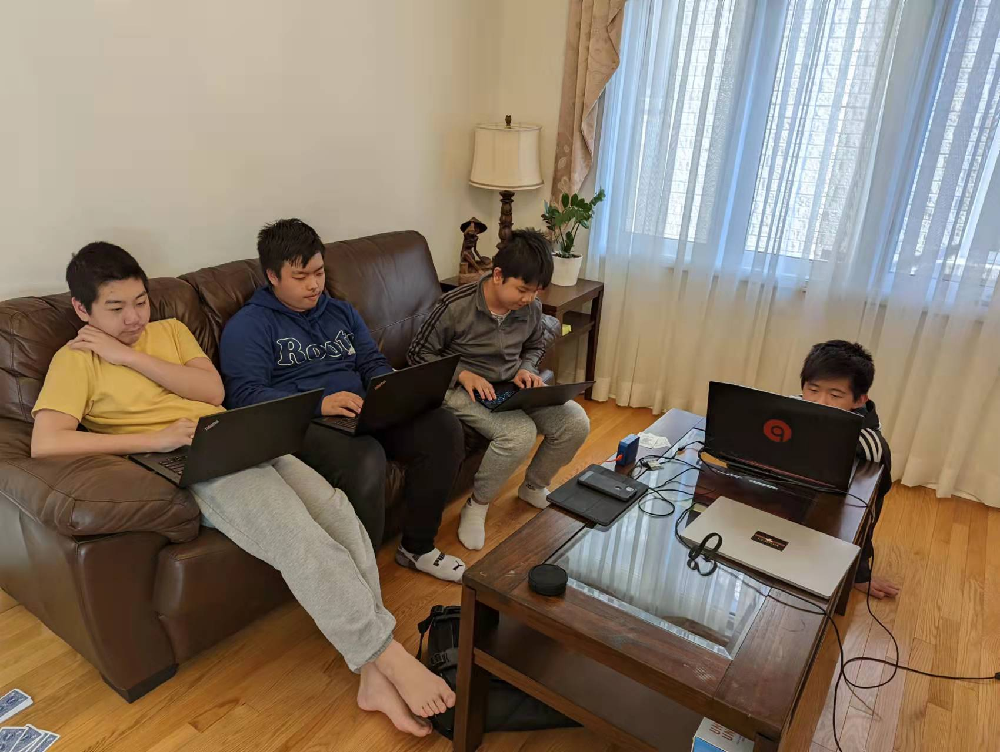
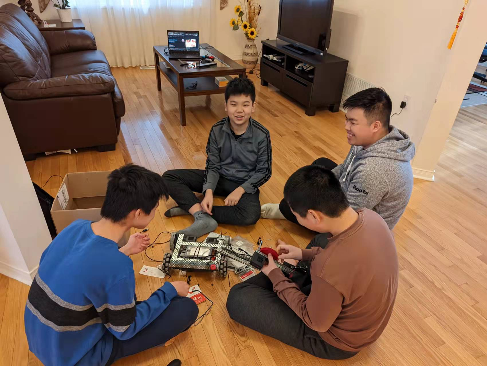

# Activities

## 2022-05-07

* Experimented and debugged tank-drive using callback functions
* Experimented with event functions

## 2022-04-23

* Tested programs to control the drivetrain using the two bumpers
* Tested programs to control the drivetrain using the controller

## 2022-04-02

* Fixed the issue with the arm
* Ran the Clawbot using the controller without coding
* Removed arm and claw

